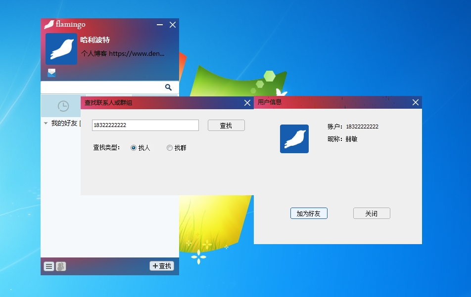
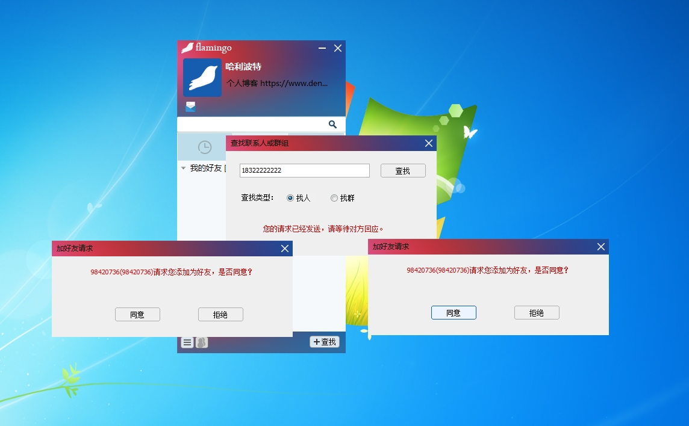
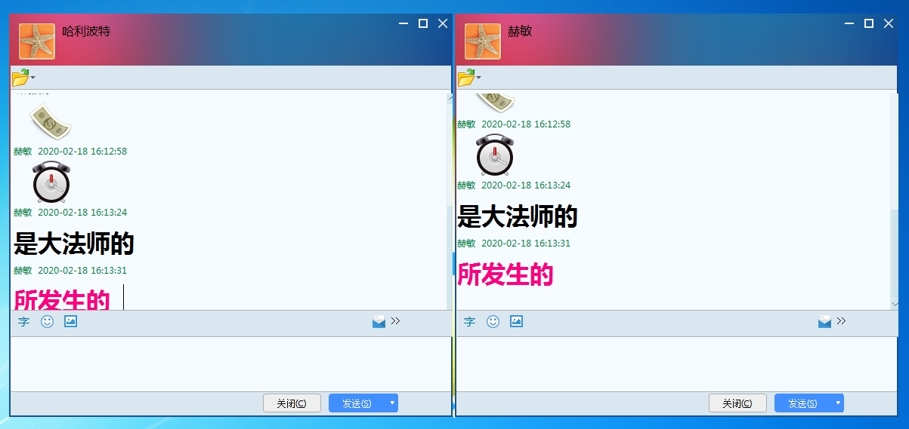

# TinyIM

一个能编写聊天机器人的IM。

## 0 程序运行的效果展示

1. 用户登录状态


2. 用户查找好友



3. 用户添加好友



4. 好友聊天



5. 机器人聊天


## 1. 项目简介

一个基于C++的IM实现     
TinyIM软件是一款实现文本单聊和文本群聊的IM软件，该软件使用C++语言编写。客户端目前支持Windows平台，后续计划支持Linux和Mac平台，服务端支持Windows、Linux、Mac平台。整个项目主要分为ClientUI,ClientCore,ChatServer三个部分。

ImRobot 作为一个聊天机器人的示例程序。
ClientUI主要完成客户端的界面显示和用户交互。
ClientCore主要完成客户端的业务逻辑操作,同时提供HTTP和TCP接口。

ChatServer主要完成IM服务器的功能。

有问题可以联系: dennismi1024@gmail.com            
或者加入QQ群：106350930                    
文档链接:https://dennisthink.github.io/index.html       
客户端的界面参考： https://github.com/balloonwj/flamingo

## 2. 支持平台

|组件|Windows|Linux|MacOS|
|---|----|----|----|
|ClientCore|支持|支持|理论支持,暂未测试|
|ClientGUI|支持|不支持|不支持|
|ChatServer|支持|支持|理论支持,暂未测试|
|ImRobot|支持|支持|理论支持,暂未测试|

## 3.编译介绍

TinyIM采用C++语言进行开发,CMake工具进行编译,目前已经在Windows7的64位上使用VS2017编译通过了。
因为代码中使用了C++11的标准,所以需要使用支持C++11标准的编译器,也就是VS2013以后的版本。
[Windows平台配置CMake](https://www.dennisthink.com/?p=380)
TinyIM主要包括3个部分的程序,分别为Server、ClientCore、ClientUI。
以下分别介绍各个部分的功能的编译步骤。

## 1. Windows平台编译
### 1.1 Server编译
ChatServer的代码在 ```\TinyIM\Code\Server\ChatServer\```目录下。

在该目录下双击build32.bat即可开始执行编译。程序编译完成后,生成的可执行文件位于 ```\TinyIM\Code\Server\ChatServer\bin\Debug\```目录下。ChatServer即为可执行文件。

### 1.2 ClientCore编译

ClientCore的代码位于```\TinyIM\Code\Client\ClientCore_TinyIM```目录下,

双击该目录下的build32.bat即可开始执行编译。
编译完成以后,生成的可执行文件位于```\TinyIM\Code\Client\ClientCore_TinyIM\bin\Debug```目录下,*ClientCore.exe* 即为可执行文件。

### 1.3 ClientUI编译
ClientUI的代码在```\TinyIM\Code\Client\ClientUI```目录下,

双击该目录下的Build.bat即可开始执行编译。编译完成以后,生成的可执行文件位于```\TinyIM\Code\Client\ClientUI\Bin\Debug\```目录下,*TinyIM.exe*即为可执行文件。


## 4.其他


